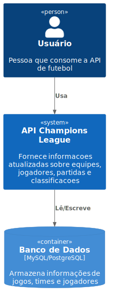

# Arquitetura da Aplicação

Este documento resume as principais decisões arquiteturais da **API Champions League**.

## Diagram do contexto

## Banco de Dados / Persistência
Optamos por um **arquivo JSON** como forma de persistência, considerando que os dados da aplicação são limitados e não exigem um banco relacional ou escalabilidade avançada. Essa abordagem simplifica a manutenção inicial e reduz dependências externas.

### Controle de Concorrência e Serialização de Operações

A camada de persistência baseada em arquivo JSON passou a utilizar um mecanismo de fila global que serializa todas as operações — tanto de leitura quanto de escrita.
Esse modelo garante acesso exclusivo ao arquivo durante qualquer operação, eliminando condições de corrida e assegurando consistência mesmo sob alta concorrência.

#### Características da Solução

- Fila única para leitura e escrita: todos os métodos—consultas, inserções, atualizações e limpeza de coleções—são enfileirados e executados de forma sequencial.

- Isolamento completo: impede sobreposição de operações que possam gerar estados intermediários inválidos.

- Atomicidade garantida: cada operação só inicia após a confirmação de conclusão da anterior.

- Detecção e propagação de falhas: erros de leitura/escrita são capturados, sinalizados e impedem que operações subsequentes executem sobre um estado inválido.

- Integridade do arquivo JSON: evita gravações parciais, corrupções silenciosas e resultados inconsistentes.

## Autenticação
A API não possui autenticação neste momento, pois o foco é disponibilizar dados públicos sobre equipes, jogadores, partidas e classificações. Em evoluções futuras, poderá ser adicionada autenticação baseada em **tokens JWT** caso seja necessário restringir o acesso.

## Cache
Não foi implementado mecanismo de cache no momento, dado o baixo volume de requisições esperado. Para cenários de maior carga, poderá ser adotado **cache em memória** ou soluções como **Redis**, aplicando TTL de 30–60 segundos em consultas mais pesadas.

## Filas e Processamento Assíncrono
Não há filas previstas. O processamento é síncrono e direto, suficiente para o escopo atual. Em caso de expansão (ex.: ingestão de dados em tempo real), poderá ser avaliada a adoção de filas simples (ex.: RabbitMQ ou SQS).

## Testes de Estresse e Robustez

Para validar este modelo de serialização total, foram implementados testes abrangentes cobrindo cenários de carga, falhas e atrasos não determinísticos.

### Concorrência Extrema

- Execução simultânea de grandes volumes de operações de leitura e escrita.

- Garantia de execução ordenada e previsível via fila global.

### Atrasos e Variabilidade de I/O

- Simulação de latências aleatórias tanto em leituras quanto em escritas.

- Confirma que a ordem lógica de operações é preservada mesmo com E/S não determinística.

### Injeção de Falhas e Corrupção

Escritas propositalmente corrompidas e falhas probabilísticas.

Validação de que o sistema identifica o erro, rejeita as operações e mantém a integridade do arquivo.

## Limitações e Considerações Atuais

Embora o mecanismo de serialização por fila garanta segurança e consistência, ele introduz algumas limitações inerentes ao modelo de persistência baseado em arquivo:

### 1. Baixa Escalabilidade sob Alta Concorrência

Como todas as operações (leitura e escrita) são enfileiradas e executadas sequencialmente, o throughput é limitado.
Em cenários com grande volume de requisições simultâneas, podem ocorrer:

    - aumento da latência por operação;

    - formação de filas maiores;

    - impactos perceptíveis no tempo de resposta da API.

### 2. Bloqueio Total por Operações Custosas

Uma operação de escrita mais demorada bloqueia:

- todas as demais escritas;

- todas as leituras subsequentes;

- toda operação que dependa da fila.

Isso é esperado dado o design, mas limita o uso em ambientes de produção com grande tráfego.

### 3. Persistência Monolítica

O armazenamento em arquivo JSON implica:

- ausência de índices;

- leitura/gravação do arquivo inteiro mesmo para pequenas operações;

- risco de latências maiores à medida que o arquivo cresce.

### 4. Ausência de Paralelismo Real

A fila garante consistência, mas elimina:

- leitura paralela;

- escrita paralela;

- qualquer otimização de acesso concorrente.

### 5. Recuperação Manual em Caso de Corrupção

Apesar da detecção de corrupção funcionar, não há:

- rollback automático,

- recriação segura do último estado íntegro,

- checkpoints.

A recuperação depende da aplicação consumidora ou intervenção manual.

### 6. Modelo Adequado Somente para Ambientes de Desenvolvimento

O design cumpre bem seu propósito em:

- testes;

- PoCs;

- aplicações educacionais;

- protótipos;

- APIs com baixo volume de tráfego.

Mas não é apropriado para:

- produção de alta carga,

- sistemas críticos,

- ambientes distribuídos.
---
